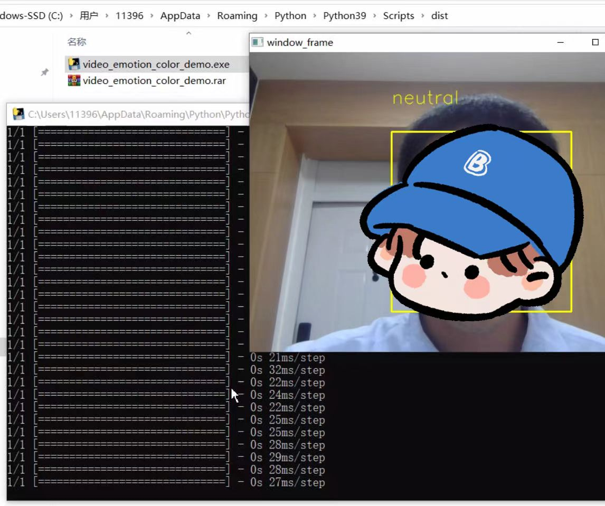
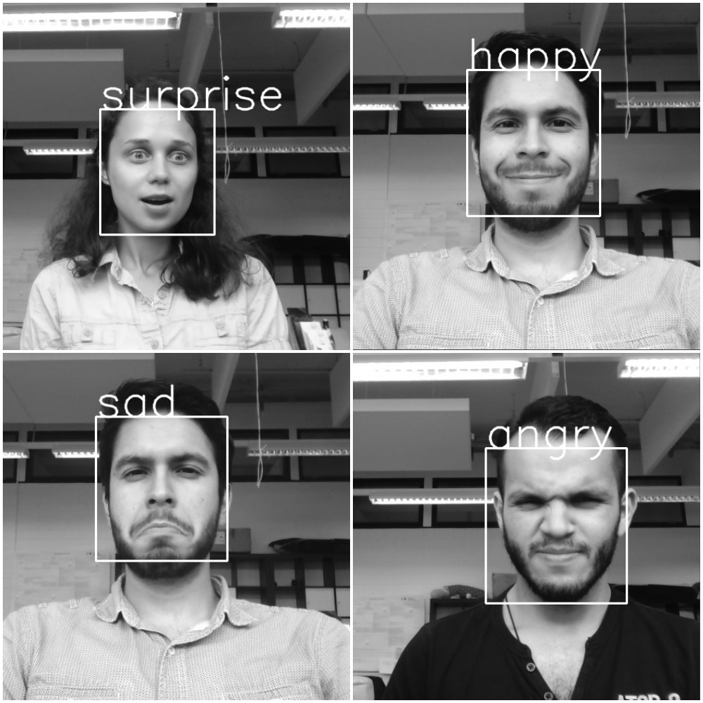

# Introduction
This project provides a code example for real-time recognition of user emotions and logging the data into a CSV file. The code is implemented based on fer2013 datasets with a keras CNN model and openCV to achieve emotion recognition functionality.  

# Background
While utilizing the face_classification project by Octavio Arriaga and his team on GitHub (https://github.com/oarriaga/face_classification), we found the program to be highly practical and efficient. However, we encountered some issues:

*Inability to output and log real-time emotion recognition data locally.  

*Lack of pre-packaged executable files for easier deployment.

# Key Features

* Emotion Recognition: Recognize the user's emotion in real-time.  

* Data Logging: Log the emotion recognition results into a CSV file for further analysis or visualization.

# Instructions

## Run real-time emotion demo with logging capability:
> python3 video_emotion_color_demo.py

## User interface

## Emotion classification data
CSV file with emotion data:

# Emotion examples:

Real-time demo:

  

